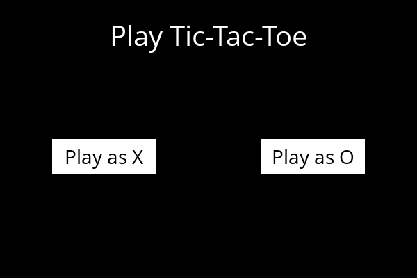
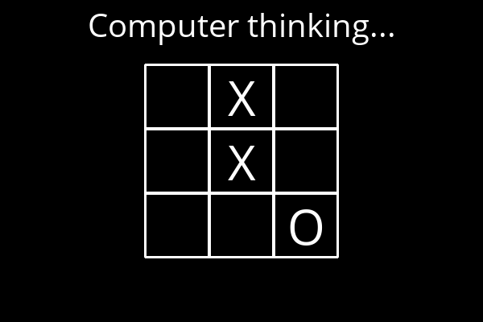
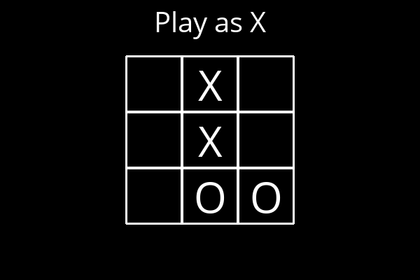

# TIC TAC TOE with AI

## Presentation

This is a user vs computer TIC TAC TOE. the logic of the computer is achieved using
minmax algorithm. **In other words the computer will never lose**





## setup

```bash
# python 3 should be installed
pip install pygame
python runner.py
```
